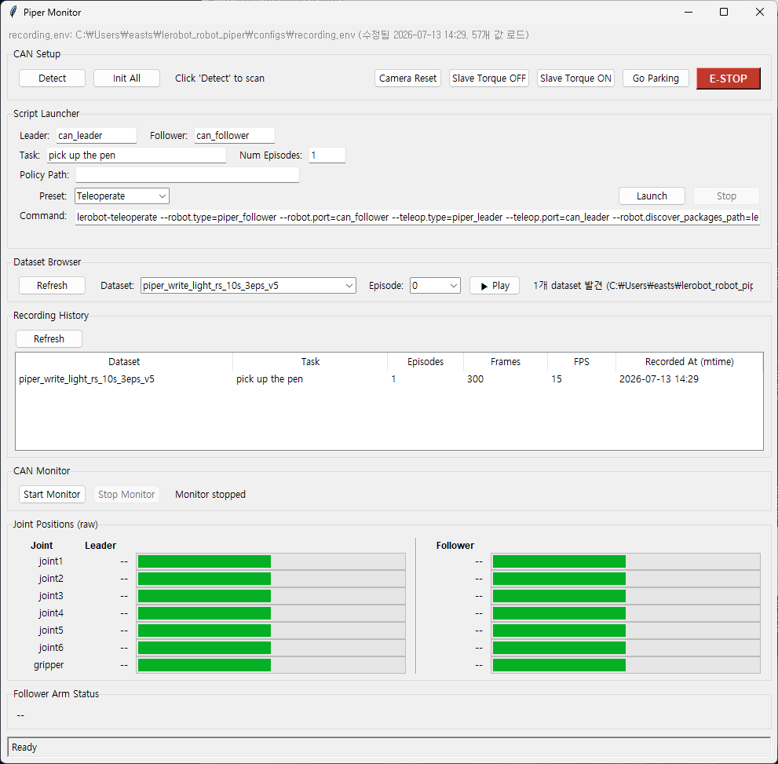
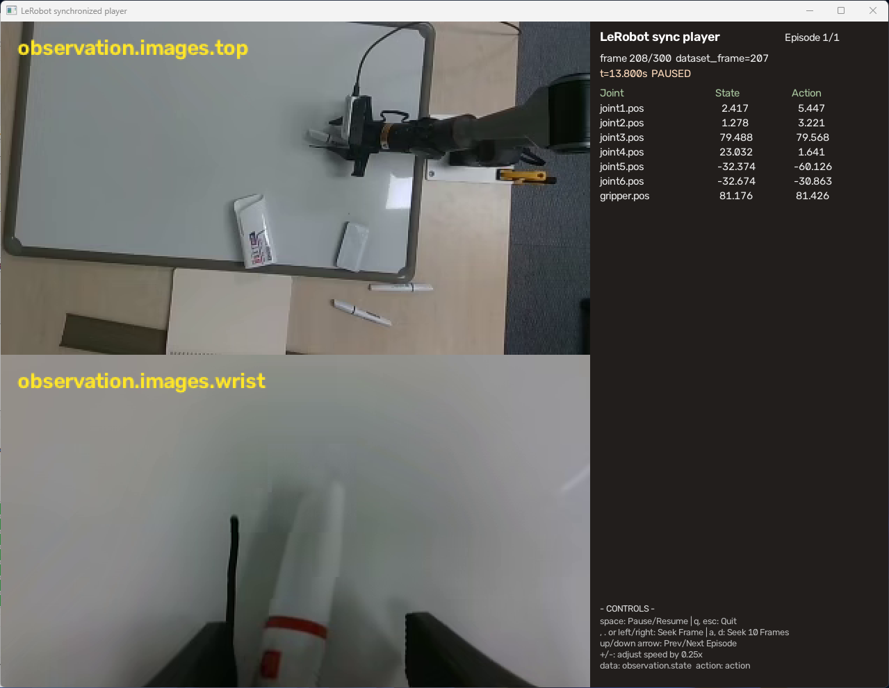

# lerobot_robot_piper

**Agilex Piper** 7-DOF 로봇팔을 위한 LeRobot 플러그인입니다. `piper_follower` 로봇 인터페이스와 `piper_leader` 텔레오퍼레이터 인터페이스를 제공하며, 이 레포에서는 실험 실행을 위해 `configs/recording.env`와 `scripts/` 번호형 스크립트를 함께 제공합니다.

> ## 📌 이 브랜치(`seongil/gui-refactor`)에서 추가한 것 — 녹화 초반 프레임 보정
>
> 매 녹화마다 각 에피소드의 **초반 N(기본 100) 프레임을 parking 자세에서 시작하도록 자동 보정**하는 기능을 추가했습니다. 모든 에피소드가 동일한 시작 자세에서 출발해 실제 시연으로 자연스럽게 이어지므로, VLA 학습용 데이터의 시작 상태가 일관돼집니다.
>
> - **`scripts/tools/smooth_start_frames.py`** (신규): LeRobotDataset v3.0의 각 에피소드 초반 프레임 `observation.state`/`action`을 parking(`INITIALIZE_POSITION`)에서 (N+1)번째 프레임까지 **선형 보간**으로 덮어씀. `v[i] = parking + (v_real[N] − parking)·(i/N)`. lerobot `compute_stats`로 `meta/stats.json`·`episodes` 통계 재계산. parking 값은 `motors/tables.py`에서 동적 import(단일 소스). 비디오는 수정하지 않음.
>   ```bash
>   python scripts/tools/smooth_start_frames.py <dataset_root> --num-frames 100   # 적용
>   python scripts/tools/smooth_start_frames.py <dataset_root> --dry-run           # 미리보기
>   ```
> - **`teleop_ui.py`**: Record 종료 후 방금 녹화한 데이터셋에 위 보정을 자동 실행. `configs/recording.env`의 `SMOOTH_START_FRAMES`로 프레임 수 조절, `0`/`false`로 비활성화.
>
> ⚠️ 개인 PC에서 정적 검증(데이터 도구 e2e)만 완료. 실물 하드웨어 녹화 검증 전에는 실제 데이터셋에 `--dry-run`으로 먼저 확인 권장.

## 주요 기능

- **Leader-Follower Teleoperation**: leader 팔의 움직임을 follower 팔에 실시간 반영
- **Dataset Recording**: joint position과 camera frame을 LeRobotDataset으로 기록
- **CAN Bus Communication**: `piper_sdk`, `wego_piper` 기반 하드웨어 제어
- **Safety Limits**: `max_relative_target`으로 timestep별 joint 이동량 제한
- **Camera Integration**: OpenCV/Intel RealSense 카메라를 follower observation으로 기록
- **통합 GUI**: Teleoperation과 데이터셋 뷰어를 하나의 GUI로 통합 (`0__launch_gui.sh`)
- **GUI Tools**: `piper-ui`, `piper-teleop`, `piper-setup`, `piper-calibrate` 제공
- **Experiment Scripts**: CAN 초기화부터 record/train/async 실행까지 번호형 스크립트 제공

## 요구 사항

- Python >= 3.10
- LeRobot >= 0.3.0
- [`piper_sdk`](https://github.com/agilexrobotics/piper_sdk)
- [`wego_piper`](https://github.com/agilexrobotics/wego_piper)
- Piper arm 및 CAN-USB interface
- 선택: OpenCV camera 또는 Intel RealSense camera

설치:

```bash
pip install -e .
```

## 빠른 시작

먼저 설정 파일을 만듭니다.

```bash
cp configs/recording.env.example configs/recording.env
```

`configs/recording.env`에서 장비에 맞게 아래 값을 수정합니다.

| 설정 | 설명 |
|---|---|
| `LEADER_PORT` | leader arm CAN 포트 |
| `FOLLOWER_PORT` | follower arm CAN 포트 |
| `CAMERA_TYPE` | `opencv` 또는 `intelrealsense` |
| `TOP_CAM` | 상방 카메라 index 또는 RealSense serial/name |
| `WRIST_CAM` | 팔목 카메라 index 또는 RealSense serial/name |
| `DATASET_REPO_ID` | 저장할 dataset 이름 |
| `DATASET_ROOT` | 로컬 dataset 저장 경로 |

기본 실행 순서 (통합 GUI 사용):

```bash
bash scripts/1__init_can.sh
bash scripts/0__launch_gui.sh
```

`0__launch_gui.sh`로 실행되는 GUI 내에서 텔레오퍼레이션, 녹화, 데이터셋 뷰어 기능까지 모두 사용할 수 있습니다.

---

기존의 개별 스크립트 실행도 여전히 지원됩니다:

```bash
bash scripts/1__init_can.sh
bash scripts/2__find_camera.sh
bash scripts/4__teleoperate.sh
bash scripts/5__record.sh
```

명령만 확인하려면 `DRY_RUN=true`를 붙입니다.

```bash
DRY_RUN=true bash scripts/4__teleoperate.sh
DRY_RUN=true bash scripts/5__record.sh
```

자세한 실행 절차는 [docs/operations.md](docs/operations.md)를 참고합니다.

## 번호형 스크립트

| 파일 | 역할 |
|---|---|
| `scripts/0__launch_gui.sh` | Teleop과 Dataset 뷰어가 통합된 메인 GUI 실행 |
| `scripts/1__init_can.sh` | CAN 인터페이스 bitrate 설정 및 선택적 USB bus 기반 rename |
| `scripts/2__find_camera.sh` | LeRobot 카메라 탐색 또는 `scripts/tools/camera_check.py` 실행 |
| `scripts/3__set_camera.sh` | `configs/recording.env`의 `TOP_CAM`/`WRIST_CAM` 갱신 |
| `scripts/4__teleoperate.sh` | `piper_follower`/`piper_leader` 텔레옵 점검 |
| `scripts/5__record.sh` | 카메라 포함 LeRobot dataset 녹화 |
| `scripts/6__replay.sh` | 녹화 dataset replay |
| `scripts/7__train.sh` | `lerobot-train` 기반 policy 학습 |
| `scripts/8__run_server.sh` | LeRobot async policy server 실행 |
| `scripts/9__run_client.sh` | LeRobot async robot client 실행 |

공통 로직은 `scripts/lib/run_common.sh`에 있습니다. 번호형 스크립트들이 이 파일을 `source`해서 env 로드, dry-run, camera/action 인자 생성을 공유합니다.

## 도구 스크립트

| 파일 | 역할 |
|---|---|
| `scripts/tools/setup_can.sh` | 수동 CAN 초기화 도구 |
| `scripts/tools/camera_check.py` | OpenCV 카메라 index grid viewer |
| `scripts/tools/realsense_view.py` | RealSense serial 확인 및 RGB stream 미리보기 |
| `scripts/tools/wego_dataset_check.py` | 녹화된 LeRobotDataset feature/action/state 점검 (현재 `0__launch_gui.sh`의 뷰어에 통합됨) |
| `scripts/tools/safe_release_torque.py` | joint1~6을 0으로 이동 후, 사람이 팔을 잡은 상태에서 수동으로 torque 해제 (`DISABLE_TORQUE_ON_DISCONNECT=false`와 짝) |

예시:

```bash
python3 scripts/tools/realsense_view.py --list
python3 scripts/tools/realsense_view.py --serial 327122074262
python3 scripts/tools/wego_dataset_check.py --dataset-repo-id local/piper_write_light --episode 0
python3 scripts/tools/safe_release_torque.py --port can_follower
```

## 하드웨어 설정

각 CAN 인터페이스는 연결 전에 활성화되어 있어야 합니다. 일반적인 수동 초기화는 다음과 같습니다.

```bash
sudo ip link set can0 type can bitrate 1000000
sudo ip link set can0 up
```

실험에서는 보통 `scripts/1__init_can.sh`를 사용합니다.

권장 매핑:

| Arm | Interface 예시 |
|---|---|
| Follower robot | `can0` 또는 `can_follower1` |
| Leader teleoperator | `can1` 또는 `can_leader1` |

`piper-setup`으로 여러 CAN 포트를 감지하고 `can_leader1`, `can_follower1` 같은 고정 이름으로 설정할 수 있습니다.

## GUI 도구

프로젝트의 핵심 기능은 `0__launch_gui.sh`를 통해 실행되는 통합 GUI에 모두 포함되어 있습니다.

```bash
bash scripts/0__launch_gui.sh
```

### 통합 GUI (`teleop_ui.py`)



Teleoperation, 데이터 녹화, 실시간 카메라 뷰, 그리고 데이터셋 뷰어 기능이 하나로 합쳐진 메인 애플리케이션입니다. 

- **Teleoperation**: Leader와 Follower 암의 상태를 실시간으로 모니터링하며 원격 조종을 수행합니다.
- **Recording**: 버튼 클릭으로 데이터셋 녹화를 시작하고 중지할 수 있습니다.
- **Camera View**: Top, Wrist 카메라 영상을 실시간으로 확인할 수 있습니다.

### 데이터셋 뷰어



통합 GUI의 'Dataset Viewer' 탭에서 사용할 수 있으며, 녹화된 데이터셋(`LeRobotDataset`)의 내용을 시각적으로 검토할 수 있습니다.

- 에피소드 및 프레임 단위 탐색
- 각 프레임의 관측(이미지), 행동(action), 상태(state) 데이터 확인

### 보조 도구

개별 기능 테스트나 하드웨어 설정을 위한 보조 GUI 도구들도 계속 지원됩니다.

#### `piper-ui`


단일 Piper arm을 직접 제어하는 간단한 UI입니다. Joint 제어, 토크 활성화/비활성화 등의 기능을 제공하여 하드웨어 점검 시 유용합니다.

```bash
piper-ui
```

#### `piper-setup`


CAN 포트 스캔, 역할(Leader/Follower) 지정, Arm 고유 이름 설정 등 여러 로봇팔의 초기 설정을 돕는 마법사(wizard)입니다.

```bash
piper-setup
```

## 직접 사용 예시

번호형 스크립트가 기본 진입점이지만, 플러그인을 직접 사용할 수도 있습니다.

### Python API

```python
from lerobot_robot_piper import PiperFollowerConfig, PiperLeaderConfig, PiperFollower, PiperLeader

follower_cfg = PiperFollowerConfig(port="can0")
leader_cfg = PiperLeaderConfig(port="can1")

follower = PiperFollower(follower_cfg)
leader = PiperLeader(leader_cfg)

follower.connect()
leader.connect()

try:
    while True:
        action = leader.get_action()
        follower.send_action(action)
        obs = follower.get_observation()
finally:
    follower.disconnect()
    leader.disconnect()
```

### LeRobot CLI

```bash
python -m lerobot.teleoperate \
    --robot.type=piper_follower \
    --robot.port=can0 \
    --teleop.type=piper_leader \
    --teleop.port=can1 \
    --robot.discover_packages_path=lerobot_robot_piper \
    --teleop.discover_packages_path=lerobot_robot_piper
```

## 설정 요약
### 3. Bimanual LeRobot CLI

Use `piper-setup` first to assign and rename four CAN ports, then run the bimanual
wrapper types:

```bash
lerobot-teleoperate \
    --robot.type=bi_piper_follower \
    --robot.left_arm_config.port=can_follower1 \
    --robot.right_arm_config.port=can_follower2 \
    --robot.id=bimanual_piper_follower \
    --teleop.type=bi_piper_leader \
    --teleop.left_arm_config.port=can_leader1 \
    --teleop.right_arm_config.port=can_leader2 \
    --teleop.id=bimanual_piper_leader \
    --display_data=true
```

Bimanual observations and actions are prefixed with `left_` and `right_`, for
example `left_joint1.pos` and `right_joint1.pos`.

---

## Configuration

### PiperFollowerConfig

### `PiperFollowerConfig`

| Parameter | Type | 설명 |
|---|---|---|
| `port` | `str` | follower arm CAN 포트 |
| `disable_torque_on_disconnect` | `bool` | disconnect 시 torque off 여부 |
| `park_on_connect` | `bool` | connect 시 parking pose 이동 여부 |
| `cameras` | `dict[str, CameraConfig]` | observation camera 설정 |
| `max_relative_target` | `float \| dict \| None` | timestep별 최대 joint 이동량 |
| `use_action_offset` | `bool` | leader/follower 시작 자세 차이 보정 |

### `PiperLeaderConfig`

| Parameter | Type | 설명 |
|---|---|---|
| `port` | `str` | leader arm CAN 포트 |
| `gripper_open_pos` | `float` | gripper open 기준값 |

## Motor Configuration

Piper arm은 7개 joint를 사용합니다. 정규화된 값 범위는 아래와 같습니다.

| Joint | Model | Normalized Range | Physical Range |
|---|---|---|---|
| Joint 1 | AGILEX-M | -100 to +100 | +/-150 deg |
| Joint 2 | AGILEX-M | -100 to +100 | 0-180 deg |
| Joint 3 | AGILEX-M | -100 to +100 | -170-0 deg |
| Joint 4 | AGILEX-S | -100 to +100 | +/-100 deg |
| Joint 5 | AGILEX-S | -100 to +100 | +/-65 deg |
| Joint 6 | AGILEX-S | -100 to +100 | +/-100-130 deg |
| Gripper | AGILEX-S | 0 to 100 | 0-68 deg |

Parking pose의 normalized 값은 `0, -100, 100, 0, 0, -13.04, 0`입니다 (`motors/tables.py`의 `INITIALIZE_POSITION` 참고 — joint2/3/6은 calibration 범위가 0 기준 비대칭이라 이 값이 실제 물리 각도 0도에 대응).

## 문서

| 문서 | 내용 |
|---|---|
| [docs/operations.md](docs/operations.md) | 실행 절차 |
| [setup_guide.md](setup_guide.md) | 환경 준비와 설정 방법 |
| [docs/data_collection_protocol.md](docs/data_collection_protocol.md) | 데이터 수집 프로토콜 |
| [docs/roadmap.md](docs/roadmap.md) | 남은 작업 |
| [docs/change_history/](docs/change_history/) | 변경 이력 (~2026-07-03, WEGO 원본 대비 초기 호환성 수정) |

### 변경 이력 (날짜별, 2026-07-02 ~ 현재)

`docs/change_history/`는 2026-07-03 이전 초기 호환성 수정까지만 다룹니다. 그 이후 브랜치별로 진행된 작업을 커밋 로그 기준으로 정리합니다.

| 날짜 | 작성자 | 구현 내용 |
|---|---|---|
| 2026-06-29 ~ 06-30 | ilseong827 | Bimanual(양팔) Piper 지원, CAN 설정 복구 로직 추가 |
| 2026-07-02 ~ 07-04 | DGIST-JaeminBaek | UGRP 워크플로 스크립트, RealSense 카메라 설정, 레코드 샘플/문서 정리 |
| 2026-07-06 | ilseong827 | 카메라 식별 헬퍼(`identify_piper_cameras.sh`) 추가 (`minjun/test` 브랜치) |
| 2026-07-07 ~ 07-08 | 조성일 | Legacy CLI 정리 + `teleop_ui.py` 확장: Record/Infer/Replay(RViz) 프리셋, Dataset Browser, Recording History, E-STOP 버튼, 카메라 릴리즈 처리 등 초기 GUI 리팩터링 핵심 작업 |
| 2026-07-10 | SEONGIL | GUI 원클릭 launcher(`0__launch_gui.sh`), safe torque 해제 도구 추가 (`ver0710` 브랜치 — 이때 있던 Replay-Record 프리셋은 07-15에 정리되어 제거됨) |
| 2026-07-14 | DarrkBllue | 통합 GUI에 Dataset Viewer(데이터셋 뷰어) 탭 통합 (`DONGKYU/gui+viewer` 브랜치) |
| 2026-07-15 | mjkwak0906-lab | Action offset warmup/safety 인자 추가 (`minjun/test` 브랜치) |
| 2026-07-15 | SEONGIL | GUI 런처 다듬기, follower torque/parking 제어, 실물 로봇 재생(Replay Real Robot) 프리셋 |
| 2026-07-17 ~ 07-18 | 조성일 | 녹화 초반 프레임을 parking에서 자연스럽게 시작하도록 자동 보정(`scripts/tools/smooth_start_frames.py`, 위 "이 브랜치에서 추가한 것" 참고), `minjun/test` + `DONGKYU/gui+viewer` 브랜치 병합·통합 |

## Project Structure

```text
.
|-- lerobot_robot_piper/      # LeRobot plugin source
|-- scripts/                  # Numbered experiment scripts
|   |-- lib/                  # Shared shell helpers
|   `-- tools/                # Manual diagnostics and checks
|-- configs/                  # Environment templates
|-- docs/                     # Project docs
|-- record_sample/            # Sample LeRobot dataset
|-- asset/                    # README/UI images
|-- pyproject.toml
`-- README.md
```
lerobot_robot_piper/
├── bi_piper_follower.py     # BiPiperFollower (two follower arms)
├── bi_piper_leader.py       # BiPiperLeader (two leader arms)
├── config_bi_piper.py       # BiPiperFollowerConfig
├── config_bi_piper_leader.py # BiPiperLeaderConfig
├── config_piper.py          # PiperFollowerConfig
├── config_piper_leader.py   # PiperLeaderConfig
├── piper_follower.py        # PiperFollower (Robot)
├── piper_leader.py          # PiperLeader (Teleoperator)
├── ui.py                    # piper-ui entrypoint
├── teleop_ui.py             # piper-monitor entrypoint
├── arm_setup_ui.py          # piper-setup entrypoint (multi-arm wizard)
└── motors/
    ├── piper_motors_bus.py  # CAN bus abstraction
    └── tables.py            # Motor model tables
```

---

## License

Apache-2.0
