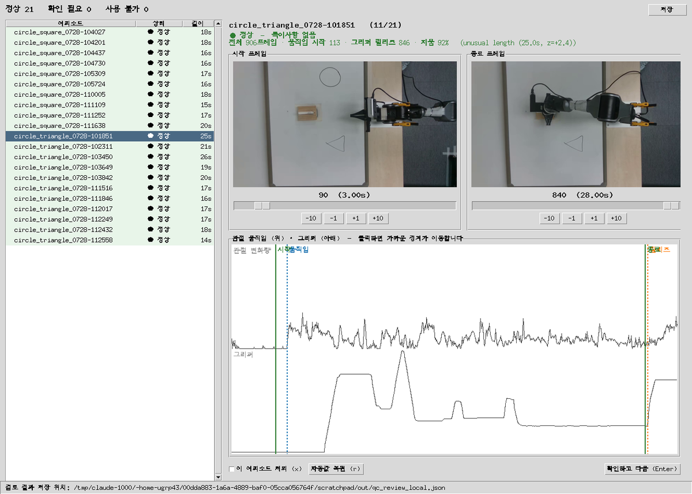
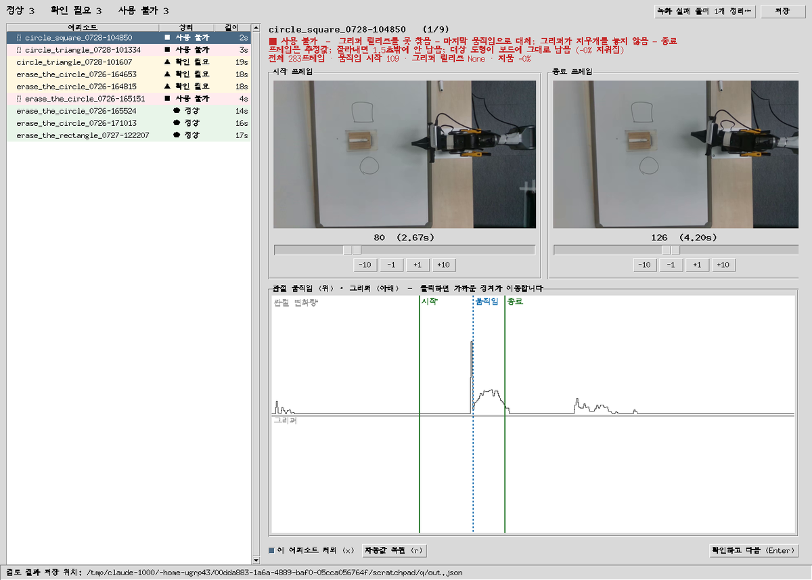
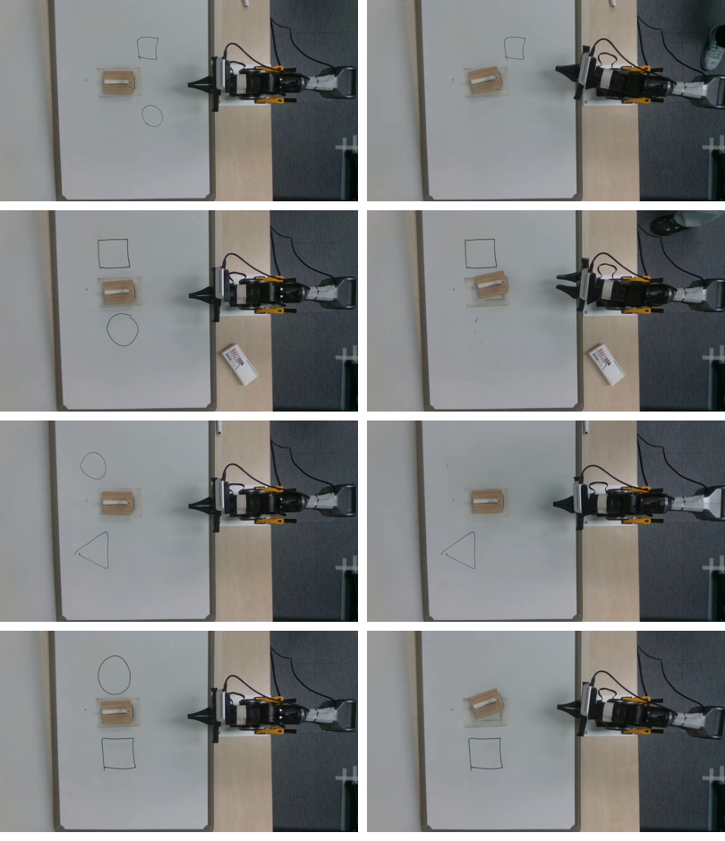
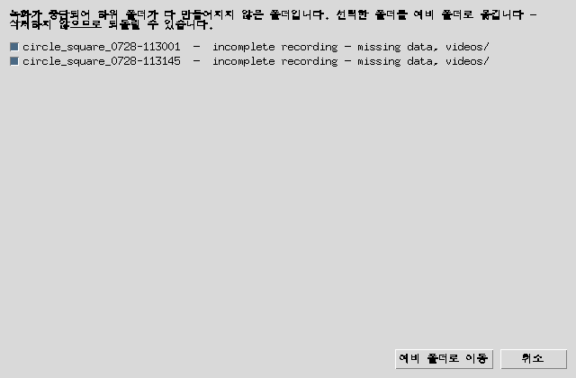
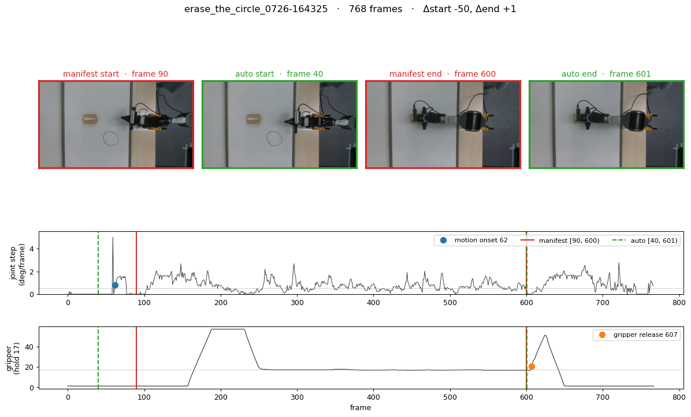

# 녹화 QC · 구간 자르기

녹화한 에피소드를 학습에 넣기 전에 (1) 쓸 만한 녹화인지 판정하고 (2) 앞뒤 대기 구간을
잘라낼 지점을 정하는 도구 모음이다. 원본 녹화와 손으로 라벨링한 매니페스트는
어떤 도구도 수정하지 않는다 — 전부 읽기만 하고 결과는 새 파일로 낸다.

| 파일 | 하는 일 |
|---|---|
| [`scripts/10__qc_studio.sh`](../scripts/10__qc_studio.sh) | 아래 GUI 실행 (conda 환경만 잡아주는 래퍼) |
| [`scripts/tools/qc_studio.py`](../scripts/tools/qc_studio.py) | QC + 구간 확인 GUI, `--report`로 표만 출력 |
| [`scripts/tools/qc_core.py`](../scripts/tools/qc_core.py) | 판정 로직 (UI 없음) |
| [`scripts/tools/episode_segmentation.py`](../scripts/tools/episode_segmentation.py) | 시작/종료 프레임 검출 |
| [`scripts/tools/autofill_frame_ranges.py`](../scripts/tools/autofill_frame_ranges.py) | 기존 매니페스트 자동 채우기 / 마진 재적합 |
| [`scripts/tools/export_cut_plan.py`](../scripts/tools/export_cut_plan.py) | JSON · CSV · ffmpeg 스크립트로 내보내기 |
| [`scripts/tools/review_cuts.py`](../scripts/tools/review_cuts.py) | 자른 지점 검토 시트 PNG 생성 |

## 빠른 시작

```bash
./scripts/10__qc_studio.sh                          # records/local 검토
./scripts/10__qc_studio.sh --folder records/0727/erase_the_circle
./scripts/10__qc_studio.sh --report                 # 창 없이 표만
```



에피소드 하나씩 보여준다. 위쪽 두 장은 잘라낼 **시작·종료 지점의 실제 영상 프레임**이고,
아래는 전체 궤적이다 — 위 곡선이 관절 변화량, 아래가 그리퍼. 파란 점선이 움직임 시작,
주황 점선이 그리퍼 릴리즈, 초록 실선이 현재 자를 지점이다.
그래프를 클릭하면 가까운 쪽 경계가 그 자리로 옮겨가고 미리보기가 바로 갱신된다.

조작: 슬라이더 · `-10/-1/+1/+10` 버튼 · 키보드
(`Enter` 확인하고 다음, `←/→` 에피소드 이동, `a`/`d` 시작 조정, `j`/`l` 종료 조정,
`r` 자동값 복원, `x` 제외).

## 신호등 판정



위 화면의 빨강 에피소드는 원이 시작·종료 프레임 양쪽에 그대로 남아 있다 — 지우기 실패다.

| 색 | 뜻 | 조건 |
|---|---|---|
| 🟢 정상 | 그대로 학습에 사용 | 아래 항목 없음 |
| 🟡 확인 필요 | 사람이 봐야 함 | 도형이 일부만 지워짐(40~80%), 보드 판독 불가, 텔레옵 끊김 |
| 🔴 사용 불가 | 그대로는 못 씀 | 폴더 미완성, 프레임 수 불일치, NaN, 프레임 간격 이상, 그리퍼 릴리즈 없음, 자르고 5초 미만, 도형이 안 지워짐(<40%) |

**얼마나 오래 걸렸는지, 몇 번 문질렀는지, 얼마나 세게 눌렀는지는 판정하지 않는다.**
느리게 여러 번 문질러서 끝냈어도 보드가 깨끗하면 좋은 에피소드다.
길이 이상치와 시작 자세 편차는 색을 바꾸지 않는 참고 메모로만 표시된다.

## 지워졌는지 어떻게 아는가

로봇이 아니라 **보드를 본다**. 첫 프레임과, 마지막 10프레임 중 가장 덜 가려진 프레임을 비교한다.
에피소드가 끝나면 팔이 홈으로 복귀하므로 보드가 완전히 드러난다.



*왼쪽이 첫 프레임, 오른쪽이 마지막 프레임. 위에서부터 원·사각형, 원·사각형, 원·삼각형, 원·사각형.*

보드 위의 어두운 픽셀 덩어리 하나가 도형 하나다. 각 도형마다 잉크가 얼마나 사라졌는지 세고,
**가장 많이 지워진 도형**을 대상으로 본다. 어떤 도형이 대상인지 미리 정해두지 않으므로
원이 아닌 걸 지우는 과제로 바뀌어도 그대로 동작한다.

임계값(80% / 40%)은 실측에서 왔다. 사람이 "지워졌다"고 보는 21개가 86~100%,
따로 빼두었던 실패 에피소드들이 -0.1% / 7% / 54% / 56%로 두 무리가 크게 벌어져 있다.

> **한계** — 첫 프레임에서 그리퍼가 도형과 겹쳐 있으면 도형이 로봇과 한 덩어리로 붙어
> 판독에 실패하고 "확인 필요"로 넘어간다. 도형을 팔 대기 위치와 겹치지 않게 그리면 안 생긴다.
> 보드 영역만 골라내는 방식도 시도했으나 실패 에피소드를 100%로 오판해서 채택하지 않았다.
> 실패를 조용히 통과시키는 것보다 사람에게 한 번 더 묻는 쪽이 안전하다.

`joint5.effort`로 접촉을 재던 이전 방식은 영상과 대조한 뒤 폐기했다.
깨끗이 지운 에피소드가 접촉 프레임 2개(중앙값 44)로 잡히는 등 오탐이 잦았다.

## 녹화 실패 폴더 정리

정상 녹화는 `data/` · `meta/` · `videos/` 세 폴더를 남긴다. 터미널에 재시도가 뜨는 경우
`meta/`만 있는 껍데기 폴더가 생기는데, 이런 폴더는 빨강으로 잡히고 툴바 버튼에서 따로 모아 보여준다.



**삭제하지 않고 `records/_quarantine/`으로 옮긴다.** 이동 전 확인 대화가 한 번 더 뜬다.
지우실 거면 내용을 확인한 뒤 그 폴더째로 지우면 된다.

## 결과 파일

`configs/qc_review_<폴더명>.json` — 예: `records/local`을 검토하면 `configs/qc_review_local.json`.
`--output`으로 바꿀 수 있다. `.gitignore`에 들어 있어 커밋되지 않는다.

```json
{
  "format_version": 1,
  "generated_by": "scripts/tools/qc_studio.py",
  "reviewed_at": "2026-07-28T12:42:38",
  "range_semantics": "start_frame is inclusive; end_frame is exclusive",
  "episodes": [
    {
      "source_dataset": "records/local/circle_square_0728-104027",
      "total_frames": 878,
      "enabled": true,
      "start_frame": 70,
      "end_frame": 605,
      "confirmed": true,
      "qc_level": "green",
      "qc_notes": [],
      "erased_ratio": 1.0,
      "auto_start_frame": 70,
      "auto_end_frame": 605
    }
  ]
}
```

| 필드 | 뜻 |
|---|---|
| `start_frame` / `end_frame` | 실제로 쓸 구간. 시작은 포함, 끝은 제외 (`[start, end)`) |
| `auto_start_frame` / `auto_end_frame` | 자동 추천값. 손으로 고쳤어도 원래 값이 남는다 |
| `confirmed` | 사람이 "확인하고 다음"을 눌렀는지 |
| `enabled` | `false`면 학습에서 제외 |
| `qc_level` / `qc_notes` | 신호등 색과 그 이유 |
| `erased_ratio` | 대상 도형이 지워진 비율 (0~1, 판독 불가면 `null`) |

`source_dataset`, `total_frames`, `enabled`, `start_frame`, `end_frame`은
`prepare_erase_shape_dataset.py`의 매니페스트와 같은 이름이라 그대로 넘길 수 있다.

```bash
python scripts/tools/prepare_erase_shape_dataset.py --manifest configs/qc_review_local.json
```

## 자를 지점은 어떻게 정하는가

```
시작 = 팔이 실제로 움직이기 시작한 프레임 − 22, 10단위 내림
종료 = 그리퍼가 지우개를 놓기 시작하는 프레임 − 6
```

- **움직임 시작**: 프레임당 관절 명령 변화량(6개 중 최대)이 대기 중엔 0.1도 미만인데,
  움직이면 0.5도를 넘어 유지된다. 3프레임 연속 초과하는 첫 프레임. 지속 조건이 중요하다 —
  대기 구간에도 단발성 노이즈가 0.5도를 넘는 경우가 있어서, 임계값만 쓰면 실제로는
  50프레임 더 기다리는 에피소드를 "2프레임에서 시작"으로 잡는다.
- **그리퍼 릴리즈**: 지우는 동안 그리퍼 명령이 평평한 값(대개 17)에 고정돼 있다.
  그 값 +1을 위로 뚫고 5프레임 이상 유지하는 **마지막** 교차 지점. 마지막만 쓰는 이유는
  처음 지우개를 잡을 때도 한 번 열리기 때문이다.

마진 22와 6은 손으로 라벨링한 60개에 맞춰 그리드 서치로 뽑았다. 정착된 라벨링 세션 기준
시작 MAE 5.7프레임(94%가 ±10 이내), 종료 MAE 2.7프레임(94%가 ±5 이내)이고,
**60개 전부 실제 동작보다 앞에서 자른다** — 동작이 잘려나가는 경우는 없다.

머신러닝(Ridge/GBR/RF)도 시험했으나 교차검증에서 규칙보다 나빴다(시작 MAE 9~10 대 5.7).
샘플 60개로는 경계가 아니라 라벨러의 반올림 습관을 학습한다.
검출기도 관절 속도·초기 자세 대비 변위·누적 이동량·follower 실측 위치까지 비교했는데
전부 반 프레임 이내로 몰린다 — 남은 오차는 검출기가 아니라 라벨 자체의 흔들림이다.

## 기존 매니페스트 다루기

이미 손으로 라벨링한 매니페스트가 있으면 `autofill_frame_ranges.py`로 비교·보완한다.

```bash
python scripts/tools/autofill_frame_ranges.py                    # 차이만 출력 (기본이 dry run)
python scripts/tools/autofill_frame_ranges.py --only-missing --write   # 빈 칸만 채움
python scripts/tools/autofill_frame_ranges.py --fit              # 기존 라벨로 마진 재적합
```

새 세션을 라벨링한 뒤 `--fit`을 돌리면 그 라벨에 맞춰 마진을 다시 뽑아준다.

## 검토 시트

`review_cuts.py`는 자른 지점을 눈으로 확인할 PNG를 만든다. 기본값은 자동값과 매니페스트가
어긋나는 에피소드만, `--all`이면 전부.



빨강이 매니페스트 라벨, 초록이 자동값이다. 위 예시는 사람 라벨(90)이 움직임 시작(62)보다
뒤에 있어 **초반 동작 28프레임이 잘려 있는** 경우다.

```bash
python scripts/tools/review_cuts.py --all
python scripts/tools/review_cuts.py --episode 0726-164325
```

시트는 `tmp/cut_review/`에 쌓인다 (`tmp/`는 gitignore 대상).

## 영상까지 자르기

```bash
python scripts/tools/export_cut_plan.py --source-dir records/local --output tmp/cut_plans/local
```

`tmp/cut_plans/`에 세 파일이 나온다.

- `.json` — 매니페스트와 같은 스키마, `prepare_erase_shape_dataset.py`에 바로 투입 가능
- `.csv` — 프레임과 초를 같이 담아 스프레드시트로 열기 좋은 형태
- `.sh` — 카메라별 ffmpeg 명령. `-c copy` 대신 `trim` 필터를 쓴다 —
  이 녹화들의 키프레임 간격이 250프레임이라 스트림 복사로 자르면 최대 8초까지 어긋난다

기존 파일이 있으면 `--force` 없이는 덮어쓰지 않는다.
