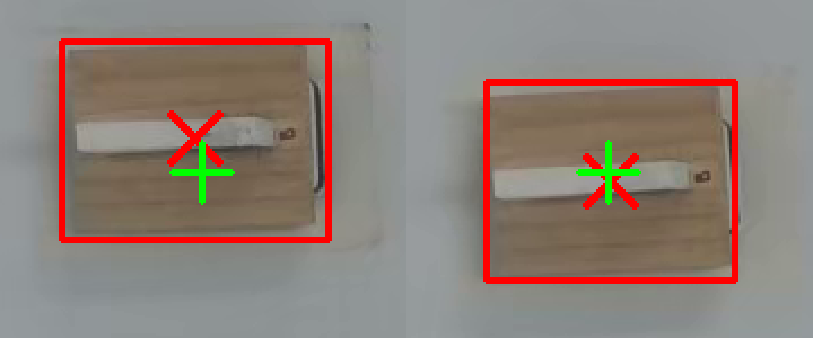

# 2026-08-18 block_alignment_tool / 도형 6-zone 315개 기준값 재보정

`block_alignment_tool.py`가 안내하는 두 종류의 기준값 — **지우개 블록 홈 위치**(단일
좌표)와 **도형을 그릴 6개 대표 위치**(zone 클러스터) — 를 315개 데이터셋 기준으로
다시 뽑은 근거를 정리한다. 둘 다 로봇 팔을 건드리지 않는 순수 분석이다.

## 1. 지우개 블록 기준점

출처: `configs/erase_shape_315_manifest.json`의 315개 원본 녹화 **첫 프레임**에서
블록 무게중심을 측정 (`block_alignment_tool.py` 상단 docstring).

- 0727(60개)은 도형 종류별로 블록을 다시 놓아서 집단 자체가 갈린다 — rectangle
  20개는 cy가 나머지보다 ~16~19px 위(다른 도형과 검증된 systematic offset이지,
  무작위 노이즈가 아니다). circle/triangle 40개는 다른 세션과 비슷한 자리라
  기준에서 제외하지 않았다.
- 그래서 0727 전체(60개, rectangle 20 + circle/triangle 40)는 기준 표본에서
  **제외**하고, 나머지 255개(0802/0804/0805/0811/0812/0813/0813pm)만으로
  기준값을 잡았다.
- 결과: `REFERENCE_CX=429.5, REFERENCE_CY=305.6`, std는 cx 1.7px / cy 2.3px.
- 이전 기준값(0802/0804/0805 120개, cx=428.9 cy=305.9)과 비교하면 cx +0.6px,
  cy −0.3px로 사실상 동일 — 표본을 315개로 넓혀도 그동안 세팅이 드리프트하지
  않았음을 재확인한 것.

코드: `scripts/tasks/erase_shape/analysis/block_alignment_tool.py` 상단 상수
(`REFERENCE_CX`/`REFERENCE_CY`/`REFERENCE_SD`).

## 2. 도형을 그릴 6개 대표 위치 (zone 클러스터)

출처: `scripts/tasks/erase_shape/augmentation/candidate_assets/records_105/asset_index.csv`
— 315개(circle/triangle/rectangle 각 105개) 원본 녹화의 `source_center_x/y`,
`source_width/height`.

3단계로 뽑았다 (`camera_overlay_view_315.py` docstring):

1. **행(위/아래) 2분할** — `cy=300`을 기준으로 나눈다. y는 뚜렷한 이봉분포라
   위쪽 74~200 / 아래쪽 410~590에 몰려 있고 중간대는 315개 중 1개뿐이다 —
   즉 실제로 "중간 행"은 존재하지 않는다.
2. **각 행 안에서 열(좌/중/우) 3분할** — `cx`를 k-means(k=3)로 나눈다. x는 y와
   달리 3개 열로 고르게 갈린다(top 36/56/64개, bottom 38/56/65개).
3. **6개 클러스터 각각의 median (cx, cy, w, h)** 를 그 클러스터의 대표 박스로
   썼다.

**§1의 블록 기준점과 달리 0727을 제외하지 않는다** — 315개 전부(0727의 도형당
20개씩 포함) 그대로 썼다. `asset_index.csv`의 circle 105행 중 파일명 timestamp로
세션을 특정할 수 있는데, `0726`/`0727` 날짜가 20개(0727 세션 분량과 정확히
일치)이고 나머지 85개가 0802~0813이다. `camera_overlay_view_315.py` docstring도
`block_alignment_tool.py`와 달리 표본 제외를 언급하지 않는다.

이 클러스터링(y=300 2분할 → 행별 k-means k=3)은 랜덤 초기화가 있는 k-means라
직접 "제외했을 때"도 같은 파이프라인(`KMeans(n_clusters=3, n_init=10,
random_state=0)`)으로 재현해 비교했다 — 추측 대신 실측:

| zone | n(315) | n(255) | Δcx (315−255) | Δcy | Δw | Δh |
|---|---:|---:|---:|---:|---:|---:|
| top-left | 36 | 35 | +0.5 | −1.3 | +1.0 | −2.0 |
| top-mid | 56 | 42 | **−4.5** | −3.0 | 0.0 | +1.0 |
| top-right | 64 | 49 | +1.3 | −0.3 | −2.5 | −2.5 |
| bottom-left | 38 | 32 | +5.8 | +5.0 | −1.0 | +1.0 |
| bottom-mid | 56 | 47 | +2.0 | −0.5 | +2.5 | +1.5 |
| bottom-right | 65 | 50 | **+7.8** | +2.0 | +1.0 | +1.5 |

차이는 대부분 1~5px, 큰 것도 bottom-right cx +7.8px 정도다 — 블록 기준점의
표본 표준편차(cx 1.7px)보다는 크지만, 그 정도로 0727을 반드시 빼야 할
수준은 아니다. 즉 **0727을 포함해도 6-zone 위치가 실질적으로 달라지지
않는다는 것을 이번에 직접 확인**했다 — 현재 코드(`OVERLAYS_315`)가 315개
전부를 쓰는 것은 이 결과와 맞고, 애초에 도형 위치 파이프라인에 세션 필터링
로직 자체가 없었다는 뜻이다(블록 기준점 쪽은 0727에서 사람이 도형 종류별로
블록을 다시 놓아 생긴 명확한 systematic offset이 있어 뺀 것이고, 이건 그런
offset이 없다는 뜻이기도 하다).

결과 6개 zone(상좌/상중/상우/하좌/하중/하우)은
`scripts/tasks/erase_shape/analysis/camera_overlay_view_315.py`의
`OVERLAYS_315`에 정규화 좌표(0~1, `cx, cy, w, h`)로 박혀 있고,
`block_alignment_tool.py --shape-zones 315`가 이를 그대로 재사용해 raw
1280×720 좌표로 오버레이한다(`block_alignment_tool.py`의
`SHAPE_ZONES`/`draw_shape_zones`).

### 135개 학습셋과의 차이

`pick_up_the_eraser_0802_0804_0805_0813pm_135` 데이터셋(0727 없음) 기준
위치는 별도로 존재한다 — 우측 열(우상/우하)의 cx가 이 315개 세트보다 약
30px 안쪽이다. **그 데이터셋으로 학습한 체크포인트를 테스트할 땐 135쪽
좌표(`--shape-zones 135`)가 더 정확하다.**

## 3. 참고

- `configs/erase_shape_315_manifest.json` — 315개 원본 녹화 매니페스트(블록 기준점 표본)
- `scripts/tasks/erase_shape/augmentation/candidate_assets/records_105/asset_index.csv` — 도형 위치 원본 315행(zone 클러스터 표본)
- `scripts/tasks/erase_shape/analysis/block_alignment_tool.py` — 실시간 블록 정렬 안내 + `--shape-zones` 오버레이
- `scripts/tasks/erase_shape/analysis/camera_overlay_view_315.py` — 6-zone 좌표 정의(`OVERLAYS_315`)
- `scripts/tasks/erase_shape/analysis/shape_position_analysis.py` — 위치 분포 분석 일반 도구
