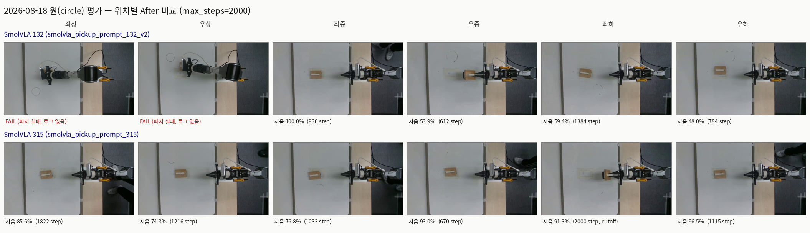

# 2026-08-18 실물 평가 — SmolVLA 132 vs 315, circle 6위치

## 1. 조건

| 항목 | 값 |
|---|---|
| 도형 | circle (테이프로 위치 고정 후 그림) |
| 시행 순서 | 좌상 → 우상 → 좌중 → 우중 → 좌하 → 우하 (모델별로 반복) |
| `--max-steps` | 2000 |
| `--stop-on-release` | 켜짐 |
| 반복 | 위치당 1회 (n=1) — 모델당 6회, 총 12회 |
| 소요 시간 | 132: 21:07:36–21:23:19 (~16분) / 315: 21:32:19–21:46:21 (~14분), 모델 교체 포함 각 15~20분 체감과 일치 |

체크포인트:

| 모델 | policy_path | dataset_root |
|---|---|---|
| SmolVLA 132 | `outputs/train/pick_up_the_eraser_and_erase_the_shape/smolvla_pickup_prompt_132_v2/checkpoints/065265/pretrained_model` | `records/outputs/pick_up_the_eraser_and_erase_the_shape/pick_up_the_eraser_0727_0812_0813am_132` |
| SmolVLA 315 | `outputs/train/pick_up_the_eraser_and_erase_the_shape/smolvla_pickup_prompt_315/checkpoints/last/pretrained_model` (168000) | `records/outputs/pick_up_the_eraser_and_erase_the_shape/pick_up_the_eraser_315` |

## 2. After 비교 (1장)

## 3. 결과표

`erase_check`가 시도 종료(park) 시점에 측정한 `target_erased`(잉크 지워진 비율) 기준. 로그: `records/hil/20260818-*/log.json`.

| 위치 | SmolVLA 132 | steps | SmolVLA 315 | steps |
|---|---:|---:|---:|---:|
| 좌상 | **FAIL** (파지 실패, 로그 없음) | — | 85.6% | 1822 |
| 우상 | **FAIL** (파지 실패, 로그 없음) | — | 74.3% | 1216 |
| 좌중 | 100.0% | 930 | 76.8% | 1033 |
| 우중 | 53.9% | 612 | 93.0% | 670 |
| 좌하 | 59.4% | 1384 | 91.3% | 2000 (cutoff) |
| 우하 | 48.0% | 784 | 96.5% | 1115 |
| **평균** | 65.3% (측정된 4개만) | | **86.3%** (6개 전부) | |

## 4. 정성 평가 (사용자 관찰)

- **132**: 위쪽 두 곳(좌상/우상)에서 지우개를 제대로 못 잡음 — 잡더라도 위쪽까지 끝까지 이동을 못 함. 중간 좌/우는 잘 지움. 하단은 전반적으로 절반 정도밖에 못 지움.
- **315**: 전반적으로 잘 지우는데 끝에 조금씩 남는다. 체감 평균 80%대.

측정치와 대조: 315의 실측 평균은 86.3%로 체감(80%대)보다 약간 높게 나왔다. 132는 상단 2곳이 아예 측정 불가(파지 실패)라 "잘 지움/못 지움"을 수치로 직접 비교하려면 이 둘을 분리해서 봐야 한다 — 측정된 4개(중좌/중우/하좌/하우)만 평균 내면 65.3%다.

## 5. 추가 관찰 (Claude)

- **표본 크기 n=1**: 위치당 1회씩만 실행했다. 지금 표의 차이(특히 132의 좌중 100% vs 우중 53.9%처럼 같은 "중간" 행 안에서도 큰 편차)가 위치 자체의 난이도 차이인지 단순 시행 편차인지는 이 데이터만으로 못 가른다. 결론을 내리려면 최소 위치당 2~3회는 필요해 보인다.
- **132의 상단 2회는 원인 불명**: `erase_run.py`가 로그 없이 끝나서(`log.json` 없음) 왜 실패했는지(파지 실패인지, 다른 예외인지) 사후에 재구성할 방법이 없다 — 남은 건 녹화된 raw 프레임뿐이다(`records/rollout/..._210758`, `..._211014`, 마지막 프레임 기준 손목 카메라가 위쪽 자세에서 멈춰있는 것만 확인됨). 앞으로 이런 실패를 분석하려면 콘솔 출력(stdout)이나 예외 traceback도 같이 저장하는 걸 고려할 만하다.
- **315의 좌하(91.3%)만 `status=finished`, 나머지는 `status=released`**: 이 시행만 `stop-on-release`가 안 걸리고 max_steps(2000) cutoff까지 다 썼다는 뜻이다. 잉크는 91%나 지웠지만 정책이 "다 끝냈다"는 신호(그리퍼 release)를 스스로 못 냈다는 거라, CLAUDE.md에 적힌 "마무리 판단 실패" 이슈와 같은 종류로 보인다.
- **132 상/중/하 패턴이 이 세션 초반에 살펴본 위치 분포 분석과 맞물린다**: `outputs/analysis/shape_positions/`, `camera_overlay_view_135.py`용으로 뽑은 위치 분포는 135개 학습 데이터셋(132와 거의 같은 세션 구성)에서도 도형이 위/아래 두 층에만 존재하고 "중간"은 실질적으로 없었다. 이번 평가에서 쓴 "좌중/우중"이 실제 학습 분포로 보면 top/bottom 클러스터 경계에 가까운 위치라, 132 모델이 그 근방에서 성능이 갈리는 것(100% vs 54%)이 우연이 아닐 수 있다 — 다음에 132/315를 다시 테스트할 땐 이 `reports/` 아래에 실제 위치 좌표(px)도 같이 기록해두면 이 가설을 검증하기 쉬워진다.
- **distractor 없음**: 모든 시행이 `max_distractor_erased=0.0` — 단일 도형 보드였고, 지금 결과는 distractor 회피 능력을 전혀 반영하지 않는다.

## 6. 참고

- 원본 로그: `records/hil/20260818-210736` ~ `records/hil/20260818-214621` (12개 폴더, `meta.json`+`log.json`+`00_reference.png`+`01_after.png`)
- 원본 롤아웃(비디오/궤적): `records/rollout/pick_up_the_eraser_0727_0812_0813am_132_rollout_20260818_*`, `records/rollout/pick_up_the_eraser_315_rollout_20260818_*`
- 위치 좌표 분석: 이 세션 대화 중 `camera_overlay_view_135.py` / `camera_overlay_view_315.py`, `block_alignment_tool.py --shape-zones` 참고
